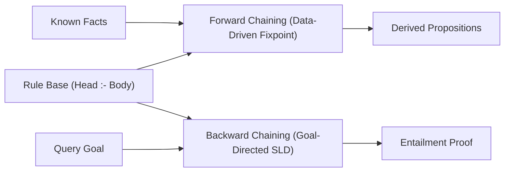

# Horn Clause Deductive Engine Skill

Definite Horn clause reasoning system featuring forward chaining fixpoint derivation and goal-directed backward chaining search.

## Features
- **100% Python Standard Library**: Linear-time forward chaining agenda algorithm.
- **Dual Inference Modes**: Forward propagation from facts or backward verification from goals.
- **Cycle Prevention**: Built-in branch history tracking.
